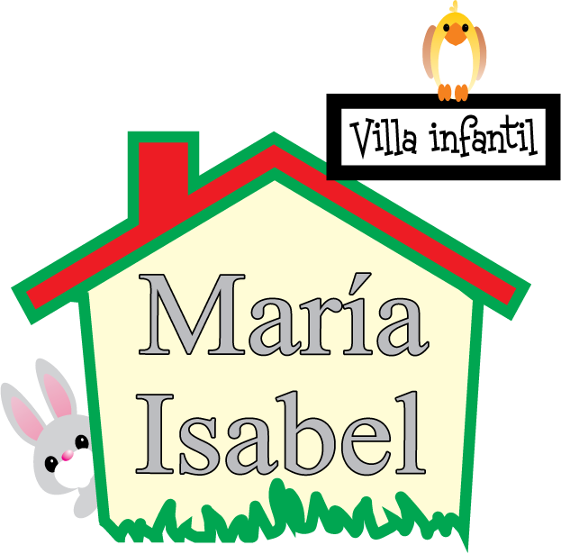

  <h1>Villa MI Site</h1>
    
    
The repository contains the creation and design of a website dedicated to function as a means of advertising for the kindergarten Villa Infantil MI.

    <a target="_blank" rel="noopener noreferrer" href="#">See website</a>      

## Prerequisites

Install nvm

- For [_Windows_](https://github.com/coreybutler/nvm-windows)
- For [_Linux_](https://github.com/nvm-sh/nvm)

## Installation

1. Install node _version 14.17.3_

   `nvm install 14.17.3`

2. Specify the version of _Node.js_

   For _Windows_

   `nvm use 14.17.3`

   For _Linux_

   `nvm use`

3. Check node version and npm respectively

   `node -v`

   `npm -v`

4. Install dependencies

   `npm ci`

5. Start a dev server and opens in a browser ---pendiente---
